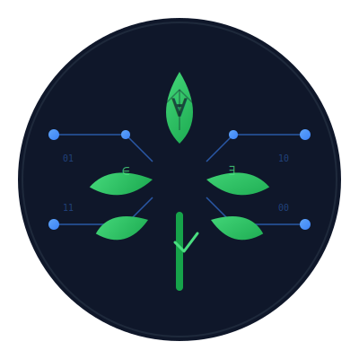

<p align="center">
  
</p>

<h1 align="center">🌿 SAGE</h1>

<p align="center">
  <strong>S</strong>emi-formal <strong>A</strong>I-<strong>G</strong>uided <strong>E</strong>ngineering Language
</p>

[](LICENSE)
[](https://leanprover.github.io/lean4/)
[](vscode-extension)

---

## Overview

SAGE is a **3-level specification language** designed for human-AI collaboration. Write specs at your comfort level—from pure natural language to formal mathematical specifications—and let AI assistants generate precise implementations.

**🎯 Why SAGE?**
- **38% fewer tokens** than natural language prompts
- **Reduces ambiguity** with structured contracts and types
- **Better code quality** through explicit requirements and constraints
- **Scales with your needs** from quick prototypes to mission-critical systems

This is the **pure Lean 4 implementation** providing a complete compiler pipeline with LSP integration for VS Code.

## Quick Start

```bash
# 1. Clone and build
git clone https://github.com/lememta/sage-lang
cd sage-lang
./build.sh

# 2. Try the compiler
.lake/build/bin/sage examples/level1-structured.sage

# 3. Run tests
.lake/build/bin/test

# 4. Install VS Code extension
./scripts/setup-vscode-lsp.sh
```

**That's it!** Open any `.sage` file in VS Code for syntax highlighting and real-time diagnostics.

## Project Structure

```
sage-lang/
├── lakefile.lean           # Lake build configuration
├── Sage.lean              # Main module exports
├── Main.lean              # CLI compiler entry point
├── MainLSP.lean           # LSP server entry point
├── Test.lean              # Test framework and runner
├── build.sh               # Build script
├── Sage/                  # Core compiler components
│   ├── Token.lean         # Token types (60+ token definitions)
│   ├── Lexer.lean         # Lexical analyzer
│   ├── AST.lean           # Abstract syntax tree
│   ├── Parser.lean        # Recursive descent parser
│   ├── TypeCheck.lean     # Semantic analysis & validation
│   └── LSP/               # Language Server Protocol
│       ├── Types.lean     # LSP protocol types
│       ├── Analysis.lean  # SAGE code analysis
│       └── Server.lean    # LSP server implementation
├── Test/                  # Comprehensive test suites
│   ├── Lexer.lean         # Lexer component tests
│   ├── Parser.lean        # Parser component tests
│   ├── TypeChecker.lean   # Type checker tests
│   └── Integration.lean   # End-to-end pipeline tests
├── vscode-extension/      # VS Code integration
├── examples/              # Example SAGE specifications
└── scripts/               # Development tools
```

## Prerequisites

- [Lean 4](https://leanprover.github.io/lean4/doc/setup.html) (latest stable version)
- [Lake](https://github.com/leanprover/lake) (Lean's build tool, comes with Lean 4)

## Building

### Build Everything

```bash
./build.sh
```

This builds:
- `sage` - The SAGE compiler CLI
- `sage-lsp` - The SAGE Language Server
- `test` - The comprehensive test suite

### Build Individual Targets

```bash
# Build compiler only
lake build sage

# Build LSP server only
lake build sage-lsp

# Build test suite only
lake build test

# Clean build artifacts
lake clean
```

## Usage

### Compiler

```bash
.lake/build/bin/sage examples/level1-structured.sage
```

### Language Server

The LSP server is designed to be used with VS Code. See the VS Code extension setup below.

To run manually:
```bash
.lake/build/bin/sage-lsp
```

## VS Code Extension with LSP

### Quick Setup

From the repository root:

```bash
./scripts/setup-vscode-lsp.sh
```

This will:
1. Build the LSP server
2. Install extension dependencies
3. Install the extension to VS Code

Then restart VS Code.

### Manual Setup

1. Build the LSP server:
   ```bash
   lake build sage-lsp
   ```

2. Install the extension:
   ```bash
   cp -r vscode-extension ~/.vscode/extensions/sage-lang-lsp-0.1.0
   ```

3. Restart VS Code

### Features

The LSP extension provides:
- **Syntax highlighting** - Color coding for SAGE constructs
- **Real-time diagnostics** - Parse and type errors as you type
- **File watching** - Automatic updates when files change

## Development

### Project Structure

The implementation follows a standard compiler pipeline:

1. **Lexer** (`Sage/Lexer.lean`) - Tokenizes source text
2. **Parser** (`Sage/Parser.lean`) - Builds AST from tokens
3. **Type Checker** (`Sage/TypeCheck.lean`) - Validates types and semantics
4. **LSP Server** (`Sage/LSP/Server.lean`) - Provides IDE integration

### Adding Features

To add new language features:

1. Add token types to `Sage/Token.lean`
2. Update lexer in `Sage/Lexer.lean`
3. Add AST nodes to `Sage/AST.lean`
4. Update parser in `Sage/Parser.lean`
5. Add type checking rules in `Sage/TypeCheck.lean`
6. Update LSP analysis in `Sage/LSP/Analysis.lean`

### Testing

#### Run Test Suite

```bash
# Run comprehensive test suite
.lake/build/bin/test
```

This runs all tests including:
- Sample framework tests
- Lexer component tests
- Parser component tests
- Type checker tests
- Integration tests (end-to-end pipeline)

#### Test Individual Components

```bash
# Test the compiler with example files
.lake/build/bin/sage examples/level0-natural.sage
.lake/build/bin/sage examples/level1-structured.sage
.lake/build/bin/sage examples/level2-formal.sage

# Test LSP (requires VS Code)
# Open a .sage file and check for diagnostics
```

## Implementation Status

### Completed
- ✅ Token definitions (60+ token types)
- ✅ AST structure
- ✅ Full lexer implementation
- ✅ Complete parser implementation
- ✅ Type checker with semantic validation
- ✅ Comprehensive test framework
- ✅ LSP server with JSON-RPC
- ✅ VS Code extension integration
- ✅ Real-time diagnostics

### In Progress
- 🚧 Advanced type inference
- 🚧 Contract verification

### Planned
- ⏳ Code completion
- ⏳ Go to definition
- ⏳ Find references
- ⏳ Hover information
- ⏳ Code actions
- ⏳ Formal verification support

## Architecture

### Compiler Pipeline

```
Source Code (.sage)
    ↓
Lexer (tokenize)
    ↓
Tokens
    ↓
Parser (parse)
    ↓
AST (Program)
    ↓
Type Checker (typeCheck)
    ↓
Validated Program
```

### LSP Server

The LSP server runs as a separate process and communicates with VS Code via JSON-RPC over stdio:

```
VS Code ←→ JSON-RPC ←→ sage-lsp ←→ SAGE Compiler
```

The server maintains document state and provides diagnostics on:
- File open (`textDocument/didOpen`)
- File change (`textDocument/didChange`)
- Diagnostic request (`textDocument/diagnostic`)

## Troubleshooting

### LSP server not starting

1. Check the server is built:
   ```bash
   ls -la lean/.lake/build/bin/sage-lsp
   ```

2. Check VS Code output:
   - Open VS Code
   - View → Output
   - Select "SAGE Language Server" from dropdown

3. Test server manually:
   ```bash
   echo '{"jsonrpc":"2.0","id":1,"method":"initialize","params":{}}' | .lake/build/bin/sage-lsp
   ```

### Extension not loading

1. Check extension is installed:
   ```bash
   ls -la ~/.vscode/extensions/sage-lang-lsp-0.1.0
   ```

2. Check for errors:
   - Help → Toggle Developer Tools
   - Check Console tab for errors

3. Reload VS Code:
   - Cmd+Shift+P → "Developer: Reload Window"

## Contributing

When contributing to the Lean implementation:

1. Follow Lean 4 style guidelines
2. Add documentation comments for public functions
3. Test with example `.sage` files
4. Update this README if adding new features

## Resources

- [Lean 4 Documentation](https://leanprover.github.io/lean4/doc/)
- [Lake Build System](https://github.com/leanprover/lake)
- [LSP Specification](https://microsoft.github.io/language-server-protocol/)
- [SAGE Language Spec](../SAGE_SPEC.md)
